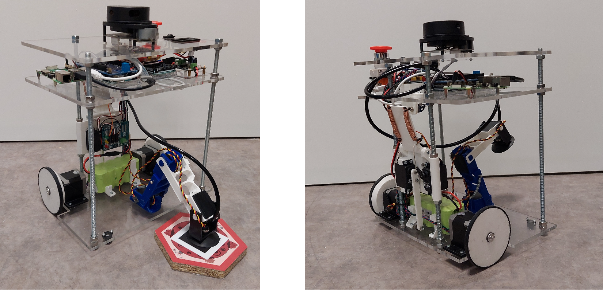

# Projet Scientifique Commun

Ce repository regroupe les différents codes qui on été fait dans le cadre de la participation à la Coupe de Robotique de France.

Le but de celle-ci était de créer un robot pouvant se mouvoir automatiquement sur le terrain de jeu et marquer différents points.

Voici le [lien](https://drive.google.com/file/d/1m_rR5cK4EjIMWk4wskNSJbaSJBMYI1s8/view?usp=sharing) du rapport de ce projet.
